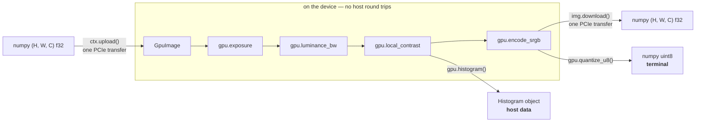
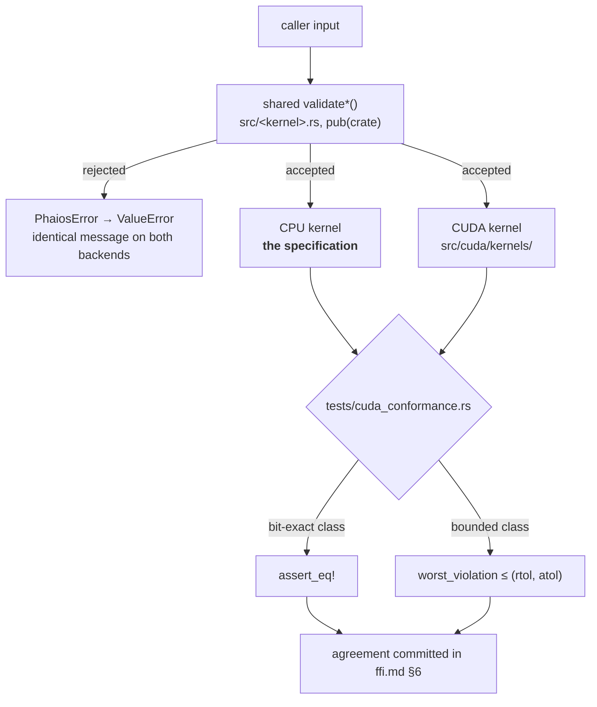

# The CUDA backend

An optional, strictly additive second surface. Everything the CPU
backend does, on an NVIDIA device, through a device-resident API that
keeps a frame on the card across a whole chain of kernels.

It is not a drop-in replacement. The CPU implementation is the
specification: every GPU kernel is validated against it, never the
other way round, and a disagreement beyond the committed bound means
the GPU kernel is wrong.

## What it is

All 27 kernels have a GPU twin. There is no CPU-only kernel. They are
built from 21 `.cu` files carrying 36 `__global__` entry points;
`sharpen` and `glow` reuse the shared `blur_device` rather than
carrying a blur of their own.

| | |
|---|---|
| Interface | [cudarc](https://crates.io/crates/cudarc), CUDA driver API only |
| Device code | `src/cuda/ptx/*.cu`, compiled to PTX by `nvcc` at build time |
| PTX target | `compute_80`, built with `-fmad=false` |
| Minimum device | compute capability **8.0** (Ampere), `MIN_COMPUTE_CAPABILITY` in `src/cuda/context.rs` |
| Cargo feature | `cuda`, off by default |
| Driver | `libcuda.so.1`, opened at run time, not linked |

The PTX is JIT-compiled forward by the driver, so one build covers the
RTX 30, 40 and 50 series and the A and H series. A device below
compute capability 8.0 is enumerated but reported unsupported.

Because the driver is dlopened rather than linked, a binary built with
`--features cuda` still runs on a machine with no NVIDIA driver at all.
It reports no devices instead of failing to load:

| Call | With no driver or no device |
|---|---|
| `gpu.available()` | `False` |
| `gpu.devices()` | `[]` |
| `gpu.GpuContext(0)` | `RuntimeError` |

Every example gated behind the feature prints why it is skipping and
exits 0 on such a machine.

## Build and run

Python:

```sh
source .phaios-venv/bin/activate
maturin develop --release --features cuda
```

Omitting `--features cuda` silently produces a CPU-only module:
`from phaios_core import gpu` then fails with `ImportError`, and the
build gives no warning. This is the single most common mistake.

Rust:

```sh
cargo build --features cuda
cargo test --features cuda
cargo run --release --example 22_gpu_pipeline --features cuda
```

`cargo test` and `cargo clippy` skip the CUDA backend entirely without
`--features cuda`: it sits behind `#[cfg]`, so even a type error there
passes. Run `./scripts/gpu-verify.sh` for what hosted CI cannot.

Build requirements: `nvcc` on `PATH` or under `$CUDA_PATH/bin` (the
build script also tries the Arch default location), and a driver new
enough for `cuMemAllocAsync`, which is CUDA 11.2.

## The device-resident chain

Upload once, run the chain on the device, download once. A chain of n
kernels written as n per-call offloads pays n PCIe round trips to
compute a result that needed two crossings.



```python
from phaios_core import gpu, GuidedFilterParams

ctx = gpu.GpuContext(0)
img = ctx.upload(array)                    # one transfer up
img = gpu.exposure(img, 0.5)
img = gpu.luminance_bw(img)
img = gpu.local_contrast(img, GuidedFilterParams(8, 0.01), 0.6)
img = gpu.encode_srgb(img)
out = img.download()                       # one transfer down
```

Three kernels end the chain because they return host data by contract:

| Kernel | Returns |
|---|---|
| `gpu.quantize_u8` | `numpy.uint8` array |
| `gpu.quantize_u16` | `numpy.uint16` array |
| `gpu.histogram` | a `Histogram` object |

There is nothing further a quantised buffer or a bin count can do on
the device, so they cross the bus rather than staying resident.

Transfers are not free, and they are the reason offload is a pipeline
decision rather than a per-call one. A 24 MP three-channel frame is
285 MiB; at roughly 8 GB/s an upload costs tens of milliseconds, more
than the whole device-side chain it feeds. Offload pays when the frame
stays resident. It does not pay per call.

Each `img = gpu.f(img)` drops the previous buffer as soon as the next
exists, so a chain of eleven kernels holds two images on the device, not
eleven. `examples/22_gpu_pipeline.rs` measures all of this.

## How the backends are kept in agreement

Validation is extracted into a shared `pub(crate) validate*` in each
kernel's module, so both backends reject identical inputs with
identical messages. Past that gate, the CPU kernel is the oracle and
`tests/cuda_conformance.rs` compares the device against it.



The predicate, stated once: a comparison passes when the worst value of
`|x − y| / (atol + rtol·|x|)` over the whole array is at most 1.0.

### Agreement classes

Four classes, and every one of the 27 kernels falls into one of them.
The reasoning behind each is in
[architecture.md](architecture.md); the normative statement is
[ffi.md §6](ffi.md#6-determinism).

| Class | Bound | Kernels |
|---|---|---|
| bit-exact | `==` | `exposure`, `luminance_bw`, `channel_mixer_bw`, `color_filter_bw`, `vignette`, `tone_curve` at `power == 1`, `crop`, `orient`, `resize`, `straighten`, `hot_pixels`, `shadow_rolloff`, `highlight_rolloff`, `apply_lut`, `histogram`, `quantize_u8`, `quantize_u16`, `film_grain`'s integer hash, every identity fast path |
| one transcendental | rtol 1e-5, atol 1e-7 | `encode_srgb`, `tone_curve` at `power != 1`, `split_toning`, `hsl_bw`, `zone_system`, `blur`, `glow`, `sharpen` |
| guided filter | rtol 1e-4, atol 1e-6 | `local_contrast`, `denoise` (both `C == 1` and `C == 3`) |
| Box–Muller | rtol 1e-3, atol 1e-5 | `film_grain`'s Box–Muller half |

Bit-exactness is achievable because the PTX is compiled with
`-fmad=false`: Rust does not contract `a*b+c` into a fused multiply-add,
and with the device told the same, every remaining operation in those
kernels is correctly rounded on both sides. The bounded kernels are
bounded because IEEE-754 standardises no transcendental at all: two
CPUs with different libms already disagree in the low bits, and CUDA
adds one more math library to that list rather than a new category of
problem.

Per-kernel bounds are also printed by
[`examples/23_gpu_selftest.rs`](../examples/23_gpu_selftest.rs), which
runs every kernel on both backends and prints the measured violation as
a fraction of its bound.

### GPU-specific limits

| Kernel | Limit |
|---|---|
| `denoise` | `radius` capped at `MAX_RADIUS = 32` on **both** backends. The device sums each window directly from its own `(2r+1)²` pixels, so cost is linear in the radius and no larger case is ever asserted |
| `blur`, `glow`, `sharpen` | below σ = 6 the device convolves directly, accumulating in Kahan-compensated f32; at or above σ = 6 both backends use f64 box passes |
| `local_contrast` | the device replaces the CPU's global f64 summed-area tables with separable box passes. This is the whole reason for its 1e-4 / 1e-6 class |
| `histogram` | the bin accumulator is bounded at 256 MiB, which on a multi-channel image binds before `MAX_BINS` does |

On non-finite input the backends may disagree without bound; see
[ffi.md §1](ffi.md#1-array-layout). That is a precondition, not a
validated input.

## The backend fingerprint

```
cuda/<device name>/cc<major>.<minor>/ptx-compute_80/nvcc-<major>.<minor>.<patch>
```

`GpuContext.fingerprint` returns it, and `GpuImage.fingerprint` returns
the fingerprint of the context the image belongs to. On this machine:

```
cuda/NVIDIA GeForce RTX 5070 Ti/cc12.0/ptx-compute_80/nvcc-13.4.59
```

The `nvcc-` segment is load-bearing. The PTX is not committed: it is
regenerated at build time by whatever toolkit is present, and the
bounded kernels inline libdevice bodies for `powf`, `expf`, `log2f` and
`cbrtf` whose code changes between toolkits. Two builds of the same
commit under different toolkits are therefore two different backends.
Until the segment existed they reported the same key, and this project
moved from toolkit 13.3 to 13.4 with the fingerprint unchanged. The
bit-exact kernels use IEEE operations only and agree across toolkits
either way.

A consumer that promises exact reproduction from a settings file must
either record the fingerprint alongside the parameters, or designate
`cpu` as the archival backend and use CUDA for interactive work.

## Determinism

Within one backend, two calls with the same input, parameters and seed
produce bit-identical output: in the same process, in another process,
on another machine with the same fingerprint, at any thread count,
block size or launch geometry. Randomness is never global and never
implicit: `film_grain` and the quantiser dither hash the pixel's own
coordinates together with an explicit `seed`, so no pixel depends on
another's state and nothing depends on the order the device schedules
its blocks.

Across backends the difference is bounded by the table above, and that
bound is asserted by the conformance suite rather than assumed. A
driver or toolkit update that regresses accuracy fails the suite.

## Performance

Measured on the machine below. These are informational figures, not CI
gates.

### Test conditions

```
Measured    2026-09-16
Image       4323 × 5765 f32 (24 MP), deterministic pseudo-random fill
GPU         NVIDIA GeForce RTX 5070 Ti, cc 12.0, driver 615.71.09
CPU         AMD Ryzen 9 9950X 16-Core, 32 threads, rayon default pool
Host        Linux 7.2.6-zen2-1-zen
nvcc        release 13.4, V13.4.59
rustc       1.98.1 (48a229cea 2026-09-01)
Fingerprint cuda/NVIDIA GeForce RTX 5070 Ti/cc12.0/ptx-compute_80/nvcc-13.4.59
Command     cargo bench --bench kernels
            cargo bench --bench gpu --features cuda
Statistic   criterion median of 100 samples
Timing      device-resident, PCIe excluded, drained by a 1×1×1 download;
            quantize and histogram include their mandatory readback
```

Both columns come from one session under one fingerprint. Run-to-run
spread on this machine reaches tens of percent for the cheaper kernels,
so compare within a table and not across two of them.

The GPU figures exclude the upload and the download, because that is
what a resident chain pays. A single kernel called through the per-call
offload form pays both transfers and will not show these ratios; see
`examples/22_gpu_pipeline.rs` for the measured difference between the
two shapes.

### Per-kernel medians

| Kernel | CPU | GPU | Speed-up | C | Benchmark id |
|---|---|---|---|---|---|
| `orient` | 140.1 ms | 1.86 ms | 75x | 3 | `orient/24MP/rotate90` |
| `hot_pixels` | 22.0 ms | 0.45 ms | 49x | 1 | `hot_pixels/24MP/1ch` |
| `denoise` | 131.7 ms | 8.06 ms | 16x | 1 | `denoise/24MP/1ch-r4` |
| `denoise` | 686.4 ms | 40.93 ms | 17x | 3 | `denoise/24MP/3ch-r4` |
| `straighten` | 53.0 ms | 2.27 ms | 23x | 3 | `straighten/24MP/2deg` |
| `crop` | 8.3 ms | 0.27 ms | 31x | 3 | `crop/24MP/centre-half` |
| `resize` | 30.9 ms | 1.44 ms | 21x | 3 | `resize/24MP/to-2048-area` |
| `exposure` | 26.7 ms | 0.88 ms | 30x | 3 | `exposure/24MP/+1EV` |
| `luminance_bw` | 12.6 ms | 0.49 ms | 26x | 3 → 1 | `luminance_bw/24MP/BT709` |
| `channel_mixer_bw` | 12.6 ms | 0.49 ms | 26x | 3 → 1 | `channel_mixer_bw/24MP` |
| `color_filter_bw` | 12.6 ms | 0.49 ms | 26x | 3 → 1 | `color_filter_bw/24MP/Red25A` |
| `hsl_bw` | 52.6 ms | 0.71 ms | 74x | 3 → 1 | `hsl_bw/24MP/8-bands` |
| `zone_system` | 14.3 ms | 0.65 ms | 22x | 1 | `zone_system/24MP/1-zone-offset` |
| `blur` | 36.8 ms | 4.25 ms | 9x | 1 | `blur/24MP/sigma2-direct` |
| `blur` | 57.2 ms | not covered | — | 1 | `blur/24MP/sigma4-direct` |
| `blur` | 78.4 ms | not covered | — | 1 | `blur/24MP/sigma5.9-direct` |
| `blur` | 70.2 ms | not covered | — | 1 | `blur/24MP/sigma6-box` |
| `blur` | 70.2 ms | 7.90 ms | 9x | 1 | `blur/24MP/sigma16-box` |
| `blur` | 70.1 ms | 8.51 ms | 8x | 1 | `blur/24MP/sigma64-box` |
| `glow` | 91.5 ms | 8.53 ms | 11x | 1 | `glow/24MP/halation` |
| `glow` | 91.4 ms | not covered | — | 1 | `glow/24MP/diffusion` |
| `glow` | 91.4 ms | not covered | — | 1 | `glow/24MP/glare` |
| `local_contrast` | 161.5 ms | 11.98 ms | 13x | 1 | `local_contrast/24MP/r=8` |
| `sharpen` | 42.2 ms | 4.11 ms | 10x | 1 | `sharpen/24MP/capture` |
| `shadow_rolloff` | 8.6 ms | 0.31 ms | 28x | 1 | `shadow_rolloff/24MP/knee0.2-strength0.8` |
| `tone_curve` | 9.0 ms | 0.35 ms | 26x | 1 | `tone_curve/24MP/slope-offset-power` |
| `film_grain` | 57.6 ms | 1.17 ms | 49x | 1 | `film_grain/24MP/size=2` |
| `split_toning` | 27.5 ms | 0.56 ms | 49x | 1 → 3 | `split_toning/24MP` |
| `vignette` | 9.6 ms | 0.42 ms | 23x | 1 | `vignette/24MP` |
| `highlight_rolloff` | 8.6 ms | 0.32 ms | 27x | 1 | `highlight_rolloff/24MP/knee0.7-white4` |
| `highlight_rolloff` | 8.6 ms | not covered | — | 1 | `highlight_rolloff/24MP/default-clip` |
| `encode_srgb` | 9.0 ms | 0.35 ms | 26x | 1 | `encode_srgb/24MP` |
| `apply_lut` | 8.8 ms | 0.32 ms | 28x | 1 | `apply_lut/24MP/256-entry` |
| `histogram` | 3.9 ms | not covered | — | 1 | `histogram/24MP/256bins-grey` |
| `histogram` | 9.7 ms | 0.47 ms | 21x | 3 | `histogram/24MP/256bins-rgb` |
| `histogram` | 6.3 ms | not covered | — | 1 | `histogram/24MP/65536bins-grey` |
| `quantize` | 5.6 ms | 3.07 ms | 2x | 1 | `quantize/24MP/u8-plain` |
| `quantize` | 9.8 ms | not covered | — | 1 | `quantize/24MP/u8-dithered` |
| `quantize` | 11.0 ms | not covered | — | 1 | `quantize/24MP/u16-dithered` |

`C` is the channel count the benchmark runs. Rows marked "not covered"
have no counterpart in `benches/gpu.rs`: the GPU suite runs one case per
cost path rather than every CPU case. `quantize_u16` has no GPU row at
all; `gpu.quantize_u16` exists and is covered by the conformance suite,
not by a benchmark.

Reading the table:

- The three B&W collapses cost the same on both backends, to two
  decimal places. They read three channels and write one, and nothing
  in any of them is expensive enough to matter beside that traffic.
- `quantize` is the one row where the ratio is small, and it is not a
  slow kernel. It is the only one whose time includes a mandatory
  readback: 24.9 MB of codes cross the bus on every call, and that
  transfer is most of the 3.07 ms. A terminal kernel cannot avoid it.
- `hsl_bw` and `orient` show the largest ratios for opposite reasons.
  `hsl_bw` is arithmetic-heavy, eight `exp` per pixel, which is what a
  GPU is for. `orient/rotate90` is cache-hostile and single-threaded on
  the CPU, so the ratio measures a known-slow CPU kernel as much as a
  fast device one.
- `denoise` at three channels is the most expensive kernel in the crate
  on either backend. Its cost is linear in the radius, which is why
  `radius` is capped at 32.
- The whole CPU chain that `examples/22_gpu_pipeline.rs` runs, eleven
  stages at 24 MP, measures about 416 ms against 56 ms for the
  device-resident form, upload and download included. That is 7.4x, not
  the 20x an individual row suggests, because the resident chain still
  pays two PCIe crossings and the cheap kernels are bus-bound on both
  sides.

## Verifying on your GPU

```sh
./scripts/gpu-verify.sh              # full run
./scripts/gpu-verify.sh --quick      # skip the release-profile examples
```

It runs, in order:

1. an environment probe: `nvcc --version`, `nvidia-smi`,
   `rustc --version`, the crate version;
2. `cargo fmt --check`;
3. `cargo clippy --all-targets --features cuda -- -D warnings`;
4. `PHAIOS_REQUIRE_GPU=1 cargo test --features cuda`: the environment
   variable turns the conformance suite's device-missing skip into a
   hard failure, so a green run cannot mean "quietly skipped the CUDA
   tests";
5. every example with `required-features = ["cuda"]`, discovered from
   `cargo metadata` rather than listed;
6. if `.phaios-venv` exists and the installed module has a `gpu`
   submodule: `pytest tests/ffi_gpu.py -q` and `mypy.stubtest`;
7. the summary block.

It does not run benchmarks. It exits non-zero on the first failure, and
unlike the examples it treats a missing device as an error rather than
skipping politely.

`.github/workflows/gpu.yml` invokes the same script on a self-hosted
runner, so the hand-run command and the CI job cannot drift.

The block it prints last is the one to share:

```
phaios-core   0.2.0-dev
device        NVIDIA GeForce RTX 5070 Ti, 615.71.09
nvcc          13.4
rustc         1.98.1
host          Linux 7.2.6-zen2-1-zen x86_64
result        all GPU checks passed
```

## Confirmed on other GPUs

**No hosted CI runs the GPU suite.** GitHub's runners have neither
`nvcc` nor an NVIDIA device, so `.github/workflows/ci.yml` skips every
target behind `required-features = ["cuda"]`. The only evidence this
backend works on a given card is that someone ran it there.

| phaios-core | device | driver | nvcc | rustc | host | date | result |
|---|---|---|---|---|---|---|---|
| 0.2.0-dev | NVIDIA GeForce RTX 5070 Ti (cc 12.0) | 615.71.09 | 13.4 | 1.98.1 | Linux 7.2.6-zen2-1-zen x86_64 | 2026-09-16 | all GPU checks passed |

To add a row: run `./scripts/gpu-verify.sh` and open an issue titled
`GPU report: <device>` containing the block it printed. The table grows
by contribution, and a card, driver or toolkit this project has no
access to is worth more than another run on the one it has.

Compute capability 8.0 is the floor. The PTX targets `compute_80` and
the driver JIT-compiles it forward, so a single build covers every
supported device without a fat binary.
