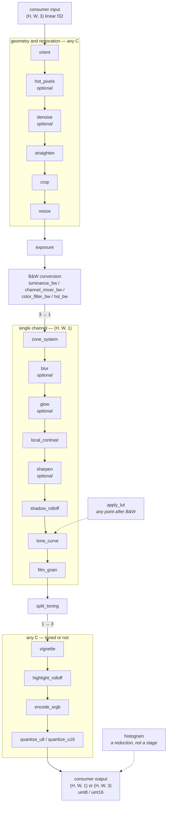

# Kernels: what each one does to the image

One section per kernel, in pipeline order. Each section gives the shape
contract, the visible effect, every parameter with its identity value
and domain, the order constraints, and the backend agreement class.

The maths and the citations are in
[architecture.md](architecture.md). The binding contract for layout,
dtype, errors and the GIL is in [ffi.md](ffi.md). The CUDA backend and
its measured performance are in [gpu.md](gpu.md).

Everything here holds for both surfaces. `phaios_core.exposure` and
`phaios_core.gpu.exposure` take the same parameters, reject the same
inputs with the same message, and differ only in the bounds recorded in
the "Backends" row.

## The pipeline

Stages marked *optional* may be left out. So may the two reached by a
dotted edge: `apply_lut` is a
transfer a caller may insert at any point after the B&W stage, and
`histogram` is a reduction rather than a stage, callable anywhere.

### Optional stages and where they go

| Stage | Recommended position | Why there |
|---|---|---|
| `hot_pixels` | right after `orient` | sensor defects must go before anything resamples or averages them into neighbours |
| `denoise` | right after `hot_pixels` | at native resolution, on defect-free data, before exposure changes the noise scale |
| `blur` | after `zone_system` | softening is a look decision, applied to the tones the zone system set |
| `glow` | after `blur` | halation belongs after `exposure` and before the tone stages; veiling glare earlier, diffusion after the tone stages |
| `sharpen` | after `local_contrast` | capture sharpening acts on the detail signal local contrast has already shaped |

### Channel counts

The image is three-channel from the input to the B&W stage, one channel
from there to `split_toning`, and three again after it. Every stage from
`vignette` onward accepts any channel count, so a pipeline that skips
`split_toning` stays at one channel and still runs to the end.

### Determinism, in one paragraph

Same backend, same input, same parameters, same seed: the same bytes,
at any thread count and any launch geometry. Across backends the
difference is bounded, the bound is committed per kernel in the
"Backends" row below, and a driver or toolkit update that breaks it
fails the conformance suite. A backend has a name: the CPU target
triple, or `GpuContext.fingerprint`. A consumer promising exact
reproduction should record it beside the parameters. Details in
[ffi.md §6](ffi.md#6-determinism).

### Errors

A bad parameter raises `ValueError`. A wrong channel count or shape
raises `ValueError`. An output larger than the 8 GiB single-allocation
limit raises `MemoryError`. A missing or unsupported CUDA device raises
`RuntimeError`. Pixel values are never validated: they must be finite,
and with a NaN or an infinity present the result is unspecified and the
backends may disagree without bound.

---

## orient

Applies one of the eight Exif dihedral orientations, as a pure index
permutation.

| | |
|---|---|
| Input | `(H, W, C)` f32, any C, any layout |
| Output | `(H, W, C)` or `(W, H, C)` f32, C-contiguous |
| Identity | `Orientation.Normal` |
| Order | first, before `crop`, so crop rectangles are expressed in the upright frame |
| Backends | bit-exact CPU/CUDA |

**What changes visually.** The picture is turned upright, or mirrored,
or both. No pixel value changes at all: the same samples come out in a
different arrangement.

| Parameter | Type | Default | Identity | Effect |
|---|---|---|---|---|
| `orientation` | `Orientation` | — | `Normal` | `Normal`, `FlipHorizontal`, `Rotate180`, `FlipVertical`, `Transpose`, `Rotate90`, `Transverse`, `Rotate270`; the Exif 0x0112 values 1..=8 |

See [architecture.md §19](architecture.md#19-geometry-crop-orientation)
and [examples/13_geometry.rs](../examples/13_geometry.rs).

## hot_pixels

Replaces a sample with its 3x3 window median when it deviates from that
median by more than a two-term criterion.

| | |
|---|---|
| Input | `(H, W, C)` f32, any C, any layout |
| Output | `(H, W, C)` f32, C-contiguous |
| Identity | none for arbitrary input; `threshold` has no default for that reason |
| Order | right after `orient`, before anything resamples or averages |
| Backends | bit-exact CPU/CUDA |

**What changes visually.** Isolated bright or dead specks disappear.
Everything else is returned untouched, bit for bit: a texture, an edge
and a star field survive, because each sample there is supported by its
neighbours rather than standing alone.

| Parameter | Type | Default | Identity | Effect |
|---|---|---|---|---|
| `threshold` | `float` | — | none | absolute tolerance, in the input's own units, finite and >= 0; `0.0` replaces every pixel with the window median |
| `relative` | `float` | `0.0` | `0.0` | tolerance proportional to the local median, `relative * abs(median)`, finite and >= 0; shot noise grows with signal, so a fixed absolute tolerance is either too loose in the shadows or too tight in the highlights |

Channels are filtered independently, and the border is index-clamped.

See [architecture.md §21](architecture.md#21-hot-pixel-removal-by-conditional-median)
and [examples/45_hot_pixels.rs](../examples/45_hot_pixels.rs).

## denoise

Guided-filter noise reduction: self-guided per channel, or cross-guided
from a shared luminance guide when the input has three channels.

| | |
|---|---|
| Input | `(H, W, C)` f32, any C, any layout |
| Output | `(H, W, C)` f32, C-contiguous |
| Identity | `amount = 0.0` |
| Order | right after `hot_pixels`, at native resolution |
| Backends | bounded, rtol 1e-4 / atol 1e-6 |

**What changes visually.** Flat areas lose their grain-like noise.
Edges keep their position and their height: the filter is
edge-preserving, so a denoised frame does not acquire the waxy,
smeared look a blur would give it. At `C = 3` all three channels are
filtered against one luminance guide, so the structure stays registered
between them.

| Parameter | Type | Default | Identity | Effect |
|---|---|---|---|---|
| `radius` | `int` | `0` | — | window is `(2r+1)` square, capped at `MAX_RADIUS = 32` on both backends; cost is linear in the radius |
| `noise_sigma` | `float` | `0.0` | — | estimated noise standard deviation in the input's own units; `eps = noise_sigma**2` regularises the filter. Finite, >= 0. `0.0` is the no-regularisation limit, legal but not on its own an identity |
| `amount` | `float` | `0.0` | `0.0` | blend between input and filtered base, in 0..=1. `1.0` is the full guided-filter base term |
| `standard` | `LuminanceStandard` | `Bt709` | — | luminance standard for the `C == 3` guide; ignored at any other channel count |

See [architecture.md §22](architecture.md#22-guided-filter-noise-reduction-self--and-cross-guided)
and [examples/47_denoise.rs](../examples/47_denoise.rs).

## straighten

Rotates the frame by a small angle and returns the largest inscribed
rectangle, resampled with Catmull-Rom.

| | |
|---|---|
| Input | `(H, W, C)` f32, any C, any layout; an empty input is rejected |
| Output | `(H', W', C)` f32, C-contiguous, the inscribed rectangle |
| Identity | `degrees = 0.0` |
| Order | after `orient`, before `crop` |
| Backends | bit-exact CPU/CUDA |

**What changes visually.** A tilted horizon comes level. The frame
shrinks, because the corners of the rotated image fall outside it. Fine
detail softens very slightly, as it does under any resampling.

| Parameter | Type | Default | Identity | Effect |
|---|---|---|---|---|
| `degrees` | `float` | — | `0.0` | rotation in degrees, positive clockwise, limited to +/-45; compose with `orient` for quarter turns |

See [architecture.md](architecture.md#resampling-resize-and-straighten)
and [examples/14_resample.rs](../examples/14_resample.rs).

## crop

Copies a rectangle out of the frame.

| | |
|---|---|
| Input | `(H, W, C)` f32, any C, any layout |
| Output | `(height, width, C)` f32, C-contiguous |
| Identity | the full-frame rectangle |
| Order | after `orient` and `straighten`, before `resize`; it fixes the frame that `vignette` will centre on and the grid `film_grain` keys to |
| Backends | bit-exact CPU/CUDA |

**What changes visually.** The composition tightens. No sample value
changes: it is an index copy.

| Parameter | Type | Default | Identity | Effect |
|---|---|---|---|---|
| `x` | `int` | — | `0` | left edge, pixels from the left |
| `y` | `int` | — | `0` | top edge, pixels from the top |
| `width` | `int` | — | `W` | width of the result |
| `height` | `int` | — | `H` | height of the result |

The rectangle must lie inside the frame. A zero-size rectangle is legal
and returns an empty array.

See [architecture.md §19](architecture.md#19-geometry-crop-orientation)
and [examples/13_geometry.rs](../examples/13_geometry.rs).

## resize

Resamples to a target size with a separable polynomial filter.

| | |
|---|---|
| Input | `(H, W, C)` f32, any C, any layout; an empty input is rejected |
| Output | `(height, width, C)` f32, C-contiguous |
| Identity | the input's own size, with any filter |
| Order | last geometry stage, or export preparation |
| Backends | bit-exact CPU/CUDA |

**What changes visually.** The picture gets larger or smaller. `Area`
downsamples without aliasing and is the default for that reason;
`CatmullRom` keeps more apparent sharpness when enlarging, at the cost
of slight ringing at high-contrast edges; `Bilinear` is the softest.

| Parameter | Type | Default | Identity | Effect |
|---|---|---|---|---|
| `width` | `int` | — | `W` | target width, must be > 0 |
| `height` | `int` | — | `H` | target height, must be > 0 |
| `filter` | `ResizeFilter` | `Area` | — | `Area` (exact fractional coverage), `Bilinear`, `CatmullRom` |

See [architecture.md](architecture.md#resampling-resize-and-straighten)
and [examples/14_resample.rs](../examples/14_resample.rs).

## exposure

Scales every sample by `2**stops`, in linear light.

| | |
|---|---|
| Input | `(H, W, C)` f32, any C, any layout |
| Output | `(H, W, C)` f32, C-contiguous |
| Identity | `stops = 0.0` |
| Order | after geometry; valid before or after the B&W stage |
| Backends | bit-exact CPU/CUDA |

**What changes visually.** The whole picture gets brighter or darker by
whole stops, with no change of contrast. Highlights pushed above 1.0
are kept, not clipped, so `highlight_rolloff` can still bring them back.

| Parameter | Type | Default | Identity | Effect |
|---|---|---|---|---|
| `stops` | `float` | — | `0.0` | must be finite; `+1` doubles, `-1` halves |

See [architecture.md §2](architecture.md#2-exposure) and
[examples/07_exposure.rs](../examples/07_exposure.rs).

## luminance_bw

Collapses RGB to one channel with a standard luminance weighting.

| | |
|---|---|
| Input | `(H, W, 3)` f32, any layout |
| Output | `(H, W, 1)` f32, C-contiguous |
| Identity | none: the kernel exists to change the channel count |
| Order | the B&W stage; after `exposure`, before `zone_system` |
| Backends | bit-exact CPU/CUDA |

**What changes visually.** Colour goes; a neutral greyscale rendering
remains. Green dominates the result under every standard, so foliage
stays light and a red subject goes darker than its colour version
suggested.

| Parameter | Type | Default | Identity | Effect |
|---|---|---|---|---|
| `standard` | `LuminanceStandard` | `Bt709` | — | `Bt601`, `Bt709`, `Bt2020`; the three differ mainly in how much weight red and blue carry |

See [architecture.md §3](architecture.md#3-luminance-weights-bw-method-1)
and [examples/01_luminance.rs](../examples/01_luminance.rs).

## channel_mixer_bw

Collapses RGB to one channel with weights the caller chooses.

| | |
|---|---|
| Input | `(H, W, 3)` f32, any layout |
| Output | `(H, W, 1)` f32, C-contiguous |
| Identity | none: the kernel exists to change the channel count |
| Order | the B&W stage, as an alternative to `luminance_bw` |
| Backends | bit-exact CPU/CUDA |

**What changes visually.** The same conversion as `luminance_bw`, but
with the relative brightness of each colour under the photographer's
control. Raising the red weight lightens skin and brickwork and darkens
a blue sky. A negative weight inverts that colour's contribution, which
is the infrared look: foliage goes white, sky goes black.

| Parameter | Type | Default | Identity | Effect |
|---|---|---|---|---|
| `wr` | `float` | — | — | red weight; -2..+2 is conventional |
| `wg` | `float` | — | — | green weight |
| `wb` | `float` | — | — | blue weight |

The weights need not sum to one. Summing above one brightens the result.

See [architecture.md](architecture.md) and
[examples/02_channel_mixer.rs](../examples/02_channel_mixer.rs).

## color_filter_bw

Multiplies RGB by a Wratten-style transmission vector, then collapses
with a luminance standard.

| | |
|---|---|
| Input | `(H, W, 3)` f32, any layout |
| Output | `(H, W, 1)` f32, C-contiguous |
| Identity | `filter = NoFilter` gives the plain `luminance_bw` result |
| Order | the B&W stage |
| Backends | bit-exact CPU/CUDA |

**What changes visually.** What a coloured filter over the lens would
have done on film. A filter lightens its own colour and darkens the
opposite one: yellow and orange deepen a blue sky and hold cloud
separation, red takes the sky almost to black and cuts haze, green
lightens foliage and flatters skin, blue lifts the sky and exaggerates
haze.

| Parameter | Type | Default | Identity | Effect |
|---|---|---|---|---|
| `filter` | `ColorFilter` | `NoFilter` | `NoFilter` | `NoFilter`, `Yellow8K2`, `Orange21`, `Red25A`, `Green11X1`, `Blue47C5`; six presets, five of them Wratten filters plus the unfiltered reference |
| `standard` | `LuminanceStandard` | `Bt709` | — | the weighting used for the collapse |

See [architecture.md §4](architecture.md#4-coloured-filter-simulation-bw-method-3)
and [examples/03_color_filter.rs](../examples/03_color_filter.rs).

## hsl_bw

Scales each pixel's luminance by a weight interpolated around the hue
circle from eight band centres.

| | |
|---|---|
| Input | `(H, W, 3)` f32, any layout |
| Output | `(H, W, 1)` f32, C-contiguous |
| Identity | all eight weights `0.0` gives the plain `luminance_bw` result |
| Order | the B&W stage; it needs hue, so it cannot run after the collapse |
| Backends | bounded, rtol 1e-5 / atol 1e-7 |

**What changes visually.** A continuously tunable filter set rather
than one filter. Each of the eight hue bands can be lightened or
darkened on its own, so a sky can be deepened without touching skin
tones. Saturated colours move the most and neutrals not at all, because
the weight is scaled by how saturated the pixel is.

| Parameter | Type | Default | Identity | Effect |
|---|---|---|---|---|
| `hue_weights` | `Sequence[float]`, 8 entries | — | all `0.0` | red, orange, yellow, green, aqua, blue, purple, magenta; -1..+1 is the useful range, not clamped, each must be finite |
| `standard` | `LuminanceStandard` | `Bt709` | — | the base greyscale weighting |
| `sigma_deg` | `float` | `30.0` | — | Gaussian width in hue space, degrees, finite and > 0; larger values blend neighbouring bands, 30 makes adjacent bands overlap at roughly half weight |

See [architecture.md §5](architecture.md#5-hsl-weighted-conversion-bw-method-4)
and [examples/08_hsl_weighted.rs](../examples/08_hsl_weighted.rs).

## zone_system

Applies per-zone stop offsets, blended across the eleven Adams zones
with a Gaussian of width 0.8 zones.

| | |
|---|---|
| Input | `(H, W, 1)` f32, any layout |
| Output | `(H, W, 1)` f32, C-contiguous |
| Identity | an empty offset map |
| Order | first of the look stages after the B&W collapse |
| Backends | bounded, rtol 1e-5 / atol 1e-7 |

**What changes visually.** It lifts or lowers the tones near each zone
you offset, leaving the others where they are. Placing Zone III down by
a third of a stop deepens the shadows without touching the highlights;
lifting Zone VIII opens the brights without flattening the midtones.
Because the offsets are applied in stops on linear data, the result is a
smooth curve rather than a banded one.

| Parameter | Type | Default | Identity | Effect |
|---|---|---|---|---|
| `offsets` | `dict[int, float]` | — | `{}` | zone index 0..=10 mapped to a stop offset. Indices outside the range are rejected; offsets must be finite and are never clamped, so -3..+3 is a useful range rather than a limit |

Zone V is middle grey at 18% reflectance, and one zone is one stop.

See [architecture.md §6](architecture.md#6-zone-system-tone-curve) and
[examples/04_zone_system.rs](../examples/04_zone_system.rs).

## blur

Separable Gaussian blur.

| | |
|---|---|
| Input | `(H, W, C)` f32, any C, any layout |
| Output | `(H, W, C)` f32, C-contiguous |
| Identity | `sigma = 0.0` |
| Order | optional; recommended after `zone_system`. Also the primitive `glow` and `sharpen` are built on |
| Backends | bounded, rtol 1e-5 / atol 1e-7 |

**What changes visually.** The picture softens. Fine texture goes
first, then edges, then structure, as sigma rises. Channels are
filtered independently.

| Parameter | Type | Default | Identity | Effect |
|---|---|---|---|---|
| `sigma` | `float` | `0.0` | `0.0` | standard deviation in pixels, finite, 0 <= sigma <= `MAX_SIGMA = 4096.0`. Measured in pixels of the image as given, so scale it when working on a preview |
| `shape` | `BlurShape` | `Gaussian` | — | `Gaussian` is the only shape |

Below sigma 6 the implementation convolves directly; at or above it,
three box passes, whose cost does not grow with sigma.

See [architecture.md §16](architecture.md#16-gaussian-blur) and
[examples/20_blur.rs](../examples/20_blur.rs).

## glow

Spreads the light above a threshold and adds it back: halation,
diffusion and veiling glare in one kernel.

| | |
|---|---|
| Input | `(H, W, C)` f32, any C, any layout |
| Output | `(H, W, C)` f32, C-contiguous |
| Identity | `amount = 0.0` |
| Order | optional. Veiling glare before `exposure`; halation after `exposure` and before the tone stages; diffusion after the tone stages |
| Backends | bounded, rtol 1e-5 / atol 1e-7 |

**What changes visually.** Bright areas bleed into their surroundings.
A tight halo around specular highlights reads as halation; a wide, soft
spread reads as a diffusion filter over the enlarger; a threshold of
zero with a frame-spanning sigma lifts the blacks in proportion to how
bright the whole frame is, which is what an uncoated lens does and what
no tone curve can imitate.

| Parameter | Type | Default | Identity | Effect |
|---|---|---|---|---|
| `threshold` | `float` | `0.0` | — | level above which light scatters, finite and >= 0. Subtracted rather than used as a hard cut, so the contribution fades in smoothly. `0.0` means all light scatters |
| `sigma` | `float` | `8.0` | — | spread in pixels; small for a halo, frame-spanning for glare. Resolution-dependent |
| `amount` | `float` | `0.0` | `0.0` | how much scattered light is added back, finite and >= 0. This kernel adds light, it never subtracts it |

See [architecture.md §17](architecture.md#17-light-scattering) and
[examples/21_glow.rs](../examples/21_glow.rs).

## local_contrast

Adds back a multiple of the residual between the image and its
guided-filter base.

| | |
|---|---|
| Input | `(H, W, 1)` f32, any layout |
| Output | `(H, W, 1)` f32, C-contiguous |
| Identity | `strength = 0.0` |
| Order | after `zone_system`, before the tone stages |
| Backends | bounded, rtol 1e-4 / atol 1e-6 |

**What changes visually.** Texture and mid-scale structure come
forward: cloud detail, stonework, fabric. Because the filter is
edge-preserving, high-contrast boundaries do not gain the bright fringe
an unsharp mask would leave. A negative `strength` runs it backwards
and flattens local structure instead.

| Parameter | Type | Default | Identity | Effect |
|---|---|---|---|---|
| `radius` | `int` | — | — | window is `(2r+1)` square. Cost is independent of the radius; the implementation is O(1) per pixel |
| `eps` | `float` | — | — | regularisation, finite and >= 0. Larger values smooth more and preserve edges less |
| `strength` | `float` | — | `0.0` | must be finite. How much of the residual is added back; negative smooths |

See [architecture.md §8](architecture.md#8-guided-filter-for-local-contrast)
and [examples/05_local_contrast.rs](../examples/05_local_contrast.rs).

## sharpen

Threshold-gated Gaussian unsharp mask.

| | |
|---|---|
| Input | `(H, W, C)` f32, any C, any layout |
| Output | `(H, W, C)` f32, C-contiguous |
| Identity | `amount = 0.0`, or `sigma = 0.0` |
| Order | optional; after `local_contrast` |
| Backends | bounded, rtol 1e-5 / atol 1e-7 |

**What changes visually.** Edges gain a light and a dark fringe, which
reads as sharpness at normal viewing distance. This is a plain,
haloing unsharp mask: at high `amount` the halos become visible, which
is the trade it makes. `threshold` fades the effect out where the
detail signal is small, so flat sky and shadow noise are left alone.

| Parameter | Type | Default | Identity | Effect |
|---|---|---|---|---|
| `amount` | `float` | `0.0` | `0.0` | how much gated detail is added back, finite and >= 0. Non-negative: for smoothing use `blur`, or a negative `local_contrast` strength |
| `sigma` | `float` | `0.0` | `0.0` | radius of the blur the detail is measured against, in pixels; `blur`'s own domain, bounded by `MAX_SIGMA` |
| `threshold` | `float` | `0.0` | — | detail magnitude below which amplification fades out, finite and >= 0. In units of the residual, not of the pixel value, so useful values are much smaller than a `glow` threshold |

Channels are filtered independently. The gate is a Hermite smoothstep
rather than a hard cut, so a few ULP of backend disagreement cannot flip
a pixel between gated and ungated.

See [architecture.md §20](architecture.md#20-unsharp-masking-with-a-soft-threshold)
and [examples/43_sharpen.rs](../examples/43_sharpen.rs).

## shadow_rolloff

The toe: compresses the tones between black and the knee.

| | |
|---|---|
| Input | `(H, W, C)` f32, any C, any layout |
| Output | `(H, W, C)` f32, C-contiguous |
| Identity | `strength = 0.0` |
| Order | first of the three tone stages, before `tone_curve` |
| Backends | bit-exact CPU/CUDA |

**What changes visually.** The deepest shadows run together instead of
holding full separation down to black, the way a film emulsion behaves
below its threshold exposure. Everything above the knee is returned bit
for bit, so midtones and highlights are untouched.

| Parameter | Type | Default | Identity | Effect |
|---|---|---|---|---|
| `knee` | `float` | `0.2` | — | input above which nothing changes, in 0..=1. A hard boundary on where the curve acts, not a fade. Larger values recruit a wider band of shadows |
| `strength` | `float` | `0.0` | `0.0` | how hard the shadows are compressed, in 0..=1. One minus the slope at black: `1.0` takes that slope to zero, so near-black tones become a single black |

See [architecture.md §13](architecture.md#13-the-characteristic-curve-toe-and-shoulder)
and [examples/19_characteristic_curve.rs](../examples/19_characteristic_curve.rs).

## tone_curve

The ASC CDL slope, offset and power primary, applied per sample.

| | |
|---|---|
| Input | `(H, W, C)` f32, any C, any layout |
| Output | `(H, W, C)` f32, C-contiguous |
| Identity | `slope = 1.0`, `offset = 0.0`, `power = 1.0` |
| Order | the straight section, between `shadow_rolloff` and `film_grain` |
| Backends | bit-exact at `power == 1`; otherwise bounded, rtol 1e-5 / atol 1e-7 |

**What changes visually.** `slope` is contrast, pivoting on black.
`offset` lifts or lowers the whole scale and is what puts a milky,
lifted-black print tone into the image. `power` bends the midtones
without moving black or white: below 1 they brighten, above 1 they
darken.

| Parameter | Type | Default | Identity | Effect |
|---|---|---|---|---|
| `slope` | `float` | `1.0` | `1.0` | multiplier applied first, must be finite |
| `offset` | `float` | `0.0` | `0.0` | added after the slope, must be finite. Positive lifts black |
| `power` | `float` | `1.0` | `1.0` | exponent applied last, finite and > 0 |

See [architecture.md §7](architecture.md#7-parametric-tone-curve-asc-cdl)
and [examples/09_tone_curve.rs](../examples/09_tone_curve.rs).

## film_grain

Adds band-limited noise whose amplitude peaks in the midtones.

| | |
|---|---|
| Input | `(H, W, 1)` f32, any layout |
| Output | `(H, W, 1)` f32, C-contiguous, clamped at zero |
| Identity | `intensity = 0.0` |
| Order | after the tone stages, before `split_toning`; it keys its noise to pixel coordinates, so the frame must already be final |
| Backends | the integer hash is bit-exact; the Box-Muller half is bounded, rtol 1e-3 / atol 1e-5 |

**What changes visually.** The picture acquires grain with a size to
it, clumping the way developed silver does, rather than the flat
per-pixel speckle of sensor noise. The grain is strongest in the
midtones and fades towards black and towards white, which is where film
grain is least visible too. It also dithers the image as a side effect,
so `quantize` rarely needs its own dither afterwards.

| Parameter | Type | Default | Identity | Effect |
|---|---|---|---|---|
| `intensity` | `float` | `0.0` | `0.0` | grain standard deviation at the midtones, finite and >= 0. 0..=1 is the useful range; above 1 it swamps the image |
| `size_pixels` | `float` | `1.0` | — | characteristic grain size in pixels, finite and > 0. 0.5..=4.0 is typical. A scale, not a radius: raising it makes the clumps coarser rather than merely blurrier. Below 1 pixel it cannot be resolved |
| `seed` | `int` | `0` | — | explicit seed. Same seed, same parameters, same input, same bytes, on any thread count |

Each pixel's noise is a hash of `(seed, x, y)`, so no pixel depends on
another and the grain at a point does not move when unrelated
parameters change.

See [architecture.md §9](architecture.md#9-film-grain) and
[examples/12_film_grain.rs](../examples/12_film_grain.rs).

## split_toning

Tints shadows and highlights different colours, crossfaded across the
tonal range in OKLab.

| | |
|---|---|
| Input | `(H, W, 1)` f32, any layout |
| Output | `(H, W, 3)` f32, C-contiguous, linear sRGB |
| Identity | both tints `[0, 0, 0]`: the result is a neutral three-channel copy |
| Order | after `film_grain`; the only kernel that adds channels |
| Backends | bounded, rtol 1e-5 / atol 1e-7 |

**What changes visually.** Selenium or sepia toning. Shadows take one
colour and highlights another, and the lightness the tone stages
established does not move, because only the chroma axes of OKLab are
used. A greyscale image becomes a three-channel one whether or not a
tint was asked for.

| Parameter | Type | Default | Identity | Effect |
|---|---|---|---|---|
| `shadow_oklab` | `[float; 3]` | `[0.0, 0.0, 0.0]` | `[0, 0, 0]` | shadow tint as OKLab `[L, a, b]`; **only `a` and `b` are used**. 0.02 is a clear tint, 0.1 is heavy-handed. All three must be finite |
| `highlight_oklab` | `[float; 3]` | `[0.0, 0.0, 0.0]` | `[0, 0, 0]` | highlight tint, same convention |
| `pivot` | `float` | `0.5` | — | OKLab lightness at which the two tints mix equally, in 0..=1. OKLab L of middle grey is about 0.57, not 0.18 |
| `balance` | `float` | `0.0` | `0.0` | shifts the crossover, in -1..=1. Positive favours the highlight tint |

See [architecture.md §10](architecture.md#10-split-toning) and
[examples/11_split_toning.rs](../examples/11_split_toning.rs).

## vignette

Multiplies each pixel by a factor that depends only on its distance
from the frame centre.

| | |
|---|---|
| Input | `(H, W, C)` f32, any C, any layout |
| Output | `(H, W, C)` f32, C-contiguous, clamped at zero |
| Identity | `amount = 0.0` |
| Order | after `split_toning`; it centres on the frame it is given, so it must follow `crop` |
| Backends | bit-exact CPU/CUDA |

**What changes visually.** The corners darken, or lighten, holding the
viewer's eye in the frame the way edge burning does under an enlarger.
Distance is measured in normalised frame coordinates, so a preview and
the full-resolution render get the same vignette without rescaling
anything.

| Parameter | Type | Default | Identity | Effect |
|---|---|---|---|---|
| `amount` | `float` | `0.0` | `0.0` | strength at the corners, must be finite. **Positive darkens, negative lightens.** -1..+1 is the useful range: `+1.0` takes the corners to black |
| `feather` | `float` | `0.5` | — | width of the transition, in 0..=1. `1.0` spreads the falloff from the centre to the corners, the gentlest option. `0.0` is not a hard edge: it puts the whole transition at distance 1, which no pixel centre reaches. A near-hard edge needs `0.02` to `0.05` |
| `roundness` | `float` | `0.0` | — | corner shape, in 0..=1. `0.0` is a circle, which darkens the middle of each edge as well as the corners; `1.0` follows the frame, so only the border darkens |

This is the darkroom gesture, not a lens correction: a physical
correction has to know the lens, the aperture and the focal length, and
belongs to the RAW decoder.

See [architecture.md §11](architecture.md#11-vignette) and
[examples/10_vignette.rs](../examples/10_vignette.rs).

## highlight_rolloff

The shoulder: the explicit choice between clipping and compressing the
highlights.

| | |
|---|---|
| Input | `(H, W, C)` f32, any C, any layout |
| Output | `(H, W, C)` f32, C-contiguous |
| Identity | none; the default `knee = 1.0`, `white_point = 1.0` reproduces a hard clip exactly |
| Order | last linear stage, immediately before `encode_srgb` |
| Backends | bit-exact CPU/CUDA |

**What changes visually.** Values above the knee bend towards white
along a curve instead of being cut off at it, so a specular highlight
or a bright sky keeps its modelling rather than flattening into a patch
of paper white. The curve leaves the identity at slope 1 and arrives at
white at slope 0, so neither end shows a visible edge.

| Parameter | Type | Default | Identity | Effect |
|---|---|---|---|---|
| `knee` | `float` | `1.0` | — | where compression begins, in 0..=1. Values at or below it pass through untouched. Lowering it buys smoother highlights at the cost of contrast just below white |
| `white_point` | `float` | `1.0` | — | the scene value that becomes pure white, finite and >= 1.0. `4.0` means two stops above nominal white survive as detail. Anything above it is white |

See [architecture.md §13](architecture.md#13-the-characteristic-curve-toe-and-shoulder)
and [examples/16_highlight_rolloff.rs](../examples/16_highlight_rolloff.rs).

## encode_srgb

Applies the IEC 61966-2-1 transfer function.

| | |
|---|---|
| Input | `(H, W, C)` f32, any C, any layout, scene-referred linear |
| Output | `(H, W, C)` f32, C-contiguous, display-referred |
| Identity | none; the transfer is the kernel |
| Order | the last stage before `quantize_*`; the only kernel producing display-referred output |
| Backends | bounded, rtol 1e-5 / atol 1e-7 |

**What changes visually.** Everything gets lighter, especially the
shadows, because the transfer is roughly a 1/2.2 power. Nothing after
this point may treat the data as linear. Values are not clamped: pass
values in 0..=1 if what follows requires them.

This kernel takes no parameters.

See [architecture.md §12](architecture.md#12-srgb-transfer-encoding)
and [examples/06_srgb_encode.rs](../examples/06_srgb_encode.rs).

## apply_lut

Maps every sample through a caller-supplied 1-D table, with linear
interpolation between entries.

| | |
|---|---|
| Input | `(H, W, C)` f32, any C, any layout, plus a 1-D f32 table |
| Output | `(H, W, C)` f32, C-contiguous |
| Identity | a table that is the identity ramp over `[min, max]` |
| Order | any point after the B&W stage |
| Backends | bit-exact CPU/CUDA |

**What changes visually.** Whatever the table says. A spline drawn in a
front end, a histogram-equalisation curve, a tabulated film
characteristic, or a deliberately non-monotone table for a Sabattier
solarisation. The kernel does not check monotonicity, which is what
makes the last of those reachable.

| Parameter | Type | Default | Identity | Effect |
|---|---|---|---|---|
| `lut` | `NDArray[float32]`, 1-D | — | identity ramp | at least 2 entries, all finite. Not a member of `LutParams`: it is the second positional argument |
| `min` | `float` | `0.0` | — | input mapped to the table's first entry. Anything at or below it takes that entry: the table is clamped, not extrapolated |
| `max` | `float` | `1.0` | — | input mapped to the last entry. Must be finite and strictly greater than `min`, with a finite difference |

A table is data, not a parameter: a consumer promising exact
reproduction must store the whole table in its sidecar. See
[export.md](export.md).

See [architecture.md §15](architecture.md#15-histogram-and-lookup-tables)
and [examples/18_histogram_lut.rs](../examples/18_histogram_lut.rs).

## histogram

Counts samples into bins, per channel, with out-of-range samples
tallied separately.

| | |
|---|---|
| Input | `(H, W, C)` f32, any C, any layout |
| Output | a `Histogram` object, not an image: `(channels, bins)` counts plus `below`, `above` and `non_finite` tallies |
| Identity | none; it is a reduction |
| Order | callable anywhere. The intended call site is after `encode_srgb`, because photographers read display-referred histograms; clipping analysis is the exception. On the GPU it returns host data and ends a device chain |
| Backends | bit-exact CPU/CUDA |

**What changes visually.** Nothing. The image is not modified.

| Parameter | Type | Default | Identity | Effect |
|---|---|---|---|---|
| `bins` | `int` | `256` | — | bins spanning `[min, max]`, at least 2 and at most `MAX_BINS = 4194304`. Channels times bins must also keep the accumulator under 256 MiB, which is the binding limit on a multi-channel image. 256 matches an 8-bit display; 65536 resolves individual 16-bit codes |
| `min` | `float` | `0.0` | — | lower edge. Samples below it are counted in `below`, not folded into bin 0 |
| `max` | `float` | `1.0` | — | upper edge, inclusive, finite and strictly greater than `min`. Exactly `max` lands in the last bin, so a white pixel reads as at white rather than clipped |

Bin counts are integers and integer addition is associative, so the
result does not depend on the order samples are visited, at any thread
count and on either backend.

See [architecture.md §15](architecture.md#15-histogram-and-lookup-tables)
and [examples/18_histogram_lut.rs](../examples/18_histogram_lut.rs).

## quantize_u8

Rounds display-referred samples to 8-bit codes, with optional dither.

| | |
|---|---|
| Input | `(H, W, C)` f32, any C, any layout, display-referred |
| Output | `(H, W, C)` **`uint8`**, C-contiguous |
| Identity | none; it changes the dtype |
| Order | terminal, after `encode_srgb`. On the GPU it returns a numpy array rather than a `GpuImage` and ends the device chain |
| Backends | bit-exact CPU/CUDA |

**What changes visually.** A smooth gradient may show contour lines
where the continuous values collapse onto 256 steps. `Dither.Tpdf`
replaces those contours with a fine, uniform noise, which the eye reads
as smooth. If `film_grain` ran at any visible intensity the image is
already dithered and `Dither.Off` is the right setting.

| Parameter | Type | Default | Identity | Effect |
|---|---|---|---|---|
| `dither` | `Dither` | `Off` | `Off` | `Off` or `Tpdf`, triangular probability density, +/-1 LSB |
| `seed` | `int` | `0` | — | seed for the dither pattern, ignored when `dither` is `Off`. The dither is `splitmix64` keyed on pixel coordinates and this seed, so the same seed reproduces the same file |

See [architecture.md §14](architecture.md#14-quantisation-and-dither),
[export.md](export.md) and
[examples/17_quantize.rs](../examples/17_quantize.rs).

## quantize_u16

Rounds display-referred samples to 16-bit codes, with optional dither.

| | |
|---|---|
| Input | `(H, W, C)` f32, any C, any layout, display-referred |
| Output | `(H, W, C)` **`uint16`**, C-contiguous |
| Identity | none; it changes the dtype |
| Order | terminal, after `encode_srgb`. On the GPU it returns a numpy array rather than a `GpuImage` and ends the device chain |
| Backends | bit-exact CPU/CUDA |

**What changes visually.** At 16 bits, banding is not a practical
problem and dither is usually pointless. The reason to choose this over
`quantize_u8` is headroom for further editing outside the pipeline.

| Parameter | Type | Default | Identity | Effect |
|---|---|---|---|---|
| `dither` | `Dither` | `Off` | `Off` | `Off` or `Tpdf` |
| `seed` | `int` | `0` | — | seed for the dither pattern, ignored when `dither` is `Off` |

Two monomorphic functions rather than one with a bit-depth argument, so
the returned dtype is a static property of the call.

See [architecture.md §14](architecture.md#14-quantisation-and-dither),
[export.md](export.md) and
[examples/17_quantize.rs](../examples/17_quantize.rs).
